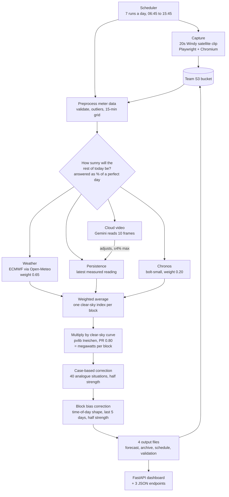

# Solar generation forecasting — Team 2 approach

Sirmour Solar Plant, 5.1 MW, Madhya Pradesh. Automated day-ahead and
intraday generation schedule at 15-minute resolution (96 blocks), refreshed
7 times a day at the run times set by the mentor brief.

---

## Flow at a glance

Capture and forecast run as two separate short-lived processes, capture
first. The browser and the Chronos model must never hold their peak memory
at the same time on the deployment box.

---

## 1. The core idea

A solar plant's output swings from zero to peak and back every single day.
Almost none of that swing is weather — it is the sun moving across the sky,
which is pure geometry and perfectly predictable.

So the problem is split in two:

| Part | Nature | How we get it |
|---|---|---|
| Where is the sun, and what would a perfect day produce? | Deterministic | Calculated exactly, from plant coordinates and panel geometry |
| How much of that sunlight actually arrives? | Uncertain | The only thing we forecast |

The second part is a single number per block — the **clear-sky index**, the
fraction of a perfect day's sunlight that gets through. Every forecasting
signal in this system answers that one question, and the answers are only
converted into megawatts at the very end.

This matters because it makes four unrelated signals directly comparable.
"70%" means the same weather statement at 8 am and at noon, even though the
megawatts differ enormously.

---

## 2. The four signals

Each one estimates the clear-sky index for every block ahead. They are
combined by weighted average, with weights tuned on backtests and validated
out-of-sample.

| Signal | What it knows | Weight |
|---|---|---|
| **Weather forecast** | Sunlight still to come — the only forward-looking input | **0.25** (re-tuned down from 0.65 on 2026-08-04) |
| **Persistence** | Today's most recent measured reading, carried forward flat | Bulk of the remainder |
| **Chronos** | The shape of today's readings so far, extended by a pretrained time-series model | 0.20, scaled down until enough of today is observed |
| **Cloud video** | Whether cloud is moving in or clearing, read from a Windy satellite clip | Adjusts persistence only; capped near ±4% of the final number |

The blended index is then multiplied by the clear-sky power curve and nudged
twice, each at half strength:

- a **case-based correction** — the 40 most similar past situations that have
  real measured outcomes;
- a **block bias correction** — the median miss each 15-minute block showed
  over the last 5 finished days, smoothed over ±90 minutes. This is the
  time-of-day gating that §6 had left open: the schedule runs high in the late
  morning and low in the mid-afternoon, and every rupee of DSM penalty falls
  in blocks 40–67 (09:45–16:30), so that is the only stretch where correcting
  anything can save money.

---

## 3. Runtime flow

Seven times a day — 06:45, 08:15, 09:45, 11:15, 12:45, 14:15, 15:45 — a
scheduler fires and runs two separate short-lived processes in sequence.

**Process 1 — capture.** A headless browser records 20 seconds of the Windy
satellite animation centred on the plant, plus still screenshots of the
solarpower and clouds layers, and uploads them to the team's S3 bucket.

**Process 2 — forecast.**

1. Pull the latest meter CSVs and the newest same-day clip from S3.
2. Preprocess: validate, remove outliers, align to the 15-minute grid.
   Each day is processed independently so nothing interpolates across the
   overnight gap.
3. Compute the four signals.
4. Blend, convert to power, apply the case-based and block bias corrections.
5. Write four outputs and push them back to S3.

The two processes are deliberately separate: the browser and the Chronos
model must never hold their peak memory at the same time on the deployment
box.

**Outputs per run**

- `outputs/forecasts/<date>_<time>.csv` — this run's forecast
- `outputs/forecasts/archive.csv` — append-only record of every run
- `outputs/schedules/current_final_schedule.csv` — actual generation for
  completed blocks, latest forecast for blocks still ahead
- `outputs/reports/<date>_end_of_day_validation.json` — written after the
  final run of the day

---

## 4. What we used

Everything is free tier or open source. No paid API is in the live path.

### Forecasting and modelling

| Tool | Role |
|---|---|
| **pvlib** | Clear-sky irradiance and solar position (Ineichen model). The physics baseline; needs no training data. |
| **Chronos** (`amazon/chronos-bolt-small`) | Pretrained zero-shot time-series model, CPU inference. No training required. |
| **pandas / numpy** | All data handling and the blend arithmetic. |
| **LightGBM** | Trained a residual-correction model. Measured, then switched off — see §6. |

### Weather

| Tool | Role |
|---|---|
| **Open-Meteo API** | Free, no API key. Delivers the **ECMWF IFS 0.25°** forecast. |
| **ECMWF IFS** | The physics model itself, chosen after a 21-day bake-off against 7 alternatives. |
| **`ecmwf-opendata`** | Client for pulling ECMWF directly. Built and tested, kept off — see §6. |

We use forecast **shortwave radiation**, not cloud-cover percentage. Cloud
cover counts thin high cirrus as full cloud when it barely dims the sun; on
2026-07-14 it read 100% while actual radiation was fine.

### Vision

| Tool | Role |
|---|---|
| **Playwright + Chromium** | Headless capture of the Windy animation at a fixed 1280×720 viewport. |
| **OpenCV** | Frame extraction, UI cropping, CLAHE contrast enhancement, Farneback optical flow. |
| **Google Gemini** (`gemini-3.5-flash`) | Reads 10 chronological colour frames and returns cloud state and trend as JSON. Free tier. |

### Infrastructure

| Tool | Role |
|---|---|
| **AWS S3** (`ap-south-1`) | Team-shared bucket: meter data in, forecasts out, video archive. |
| **AWS EC2** | Runs the 7×/day automation as a systemd service. |
| **boto3** | S3 access. Credentials in a gitignored `.env`, never committed. |
| **`schedule`** | Trigger loop, with a localhost socket lock so duplicate launches cannot stack. |
| **FastAPI + uvicorn** | Dashboard and three read-only JSON endpoints, served from files already on disk. |
| **PyYAML / python-dotenv / loguru** | Configuration, secrets, logging. |

### Data sources

| Source | Use |
|---|---|
| Plant meter CSVs (`*_SOLAR_INV.csv`) | Ground truth for generation; the persistence and Chronos signals. |
| Plant GHI sensor | Reference for validating the weather forecast's bias. |
| Windy.com satellite layer | Cloud video and layer screenshots. Public embed; no paid key required. |
| Open-Meteo / ECMWF | Forward-looking irradiance forecast. |
| Enercast | Reference comparison only. Grading is always against actual meter data. |

---

## 5. Accuracy

Measured by walk-forward backtest against actual meter data — never against
another forecaster.

| Configuration | Deviation |
|---|---|
| Physics + persistence + Chronos, no weather | 8.56% |
| \+ weather signal at 0.65 | 7.28–7.31% |
| \+ ECMWF instead of auto model selection | 6.88% |
| \+ walk-forward bias correction | **6.64%** |
| Monsoon days only, final configuration | 7.50% |

---

## 6. What we tested and rejected

Every parameter below was tuned on a backtest and then checked on days the
tuning never saw. Recording the negatives matters as much as the positives.

| Change | Result | Decision |
|---|---|---|
| Residual correction (LightGBM) | +1.14 pts before the weather signal existed; −0.37 pts after | **Off.** It was compensating for a missing forward-looking signal. |
| Weather weight 1.0 (weather only) | 7.54%, worse than the 0.65 blend | Kept the blend. |
| Trend-damped persistence | Flat persistence beat every half-life tested | Trend disabled, code retained for retesting. |
| Case-based correction at full strength | Overfits, −0.5 pts | Half strength: +0.47 pts on 12 of 17 unseen days. |
| ECMWF direct feed (no middleman) | Tracks Open-Meteo within ~36 W/m² | **Off on purpose.** Open-Meteo provides a forecast *archive* and hourly resolution; going direct would end our ability to prove future improvements. |
| Cloud-cover percentage as the weather input | Misleading with thin cirrus | Use shortwave radiation instead. |
| Optical-flow cloud motion as a predictor | Correlation +0.16 where a useful signal would be negative | Not used in the forecast. Monsoon cloud here builds convectively rather than drifting in, so past motion carries no forward information. |
| Vision weight sweep | No measurable effect at the shipped strength; consistently hurts mornings, helps afternoons | Kept at low strength. Time-of-day gating was the open lead — now closed by the block bias correction below. |
| Flat whole-day bias shift (control for the block bias correction) | Made the penalty **worse** at every strength tested | Rejected. The recoverable error is a time-of-day *shape*, not a level. |
| Per-block bias medians, unsmoothed | Worse than baseline above half strength | Smooth over ±6 blocks. Five days gives five samples per block — the raw median is mostly noise. |
| Block bias correction, ±90 min smoothing, half strength | Rs 40/day cheaper (−4.0%), 5 of 7 unseen days, −0.10 pts | **Shipped 2026-08-06.** Saves money at every lookback tested (3/4/5/7 days). |

---

## 7. Known limitations

- The vision signal's influence is structurally capped near ±4% by where it
  enters the blend, independent of how good the video is.
- Windy captures rely on fixed pixel coordinates for the layer and play
  controls, which is fragile when the page layout changes.
- `requirements.txt` omits Playwright, so a fresh clone cannot run the
  capture without installing it separately.
- Tilt and azimuth are assumptions (latitude and true south) — the site did
  not provide actual values.
